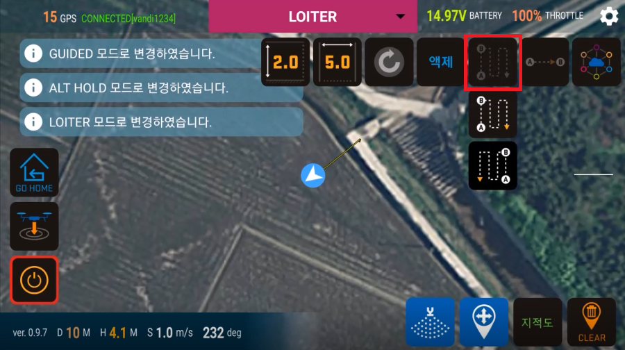
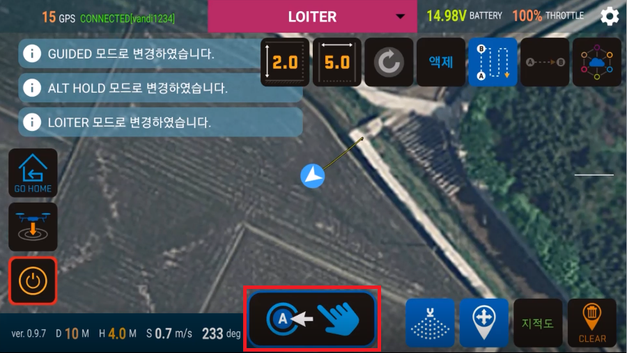
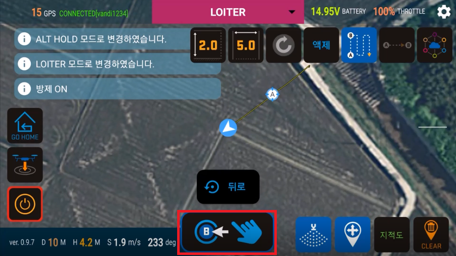
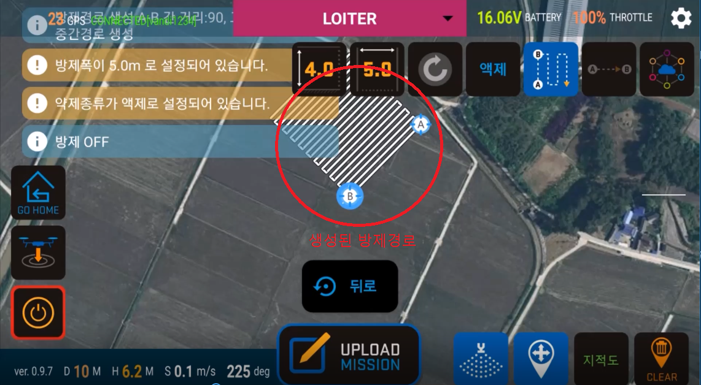
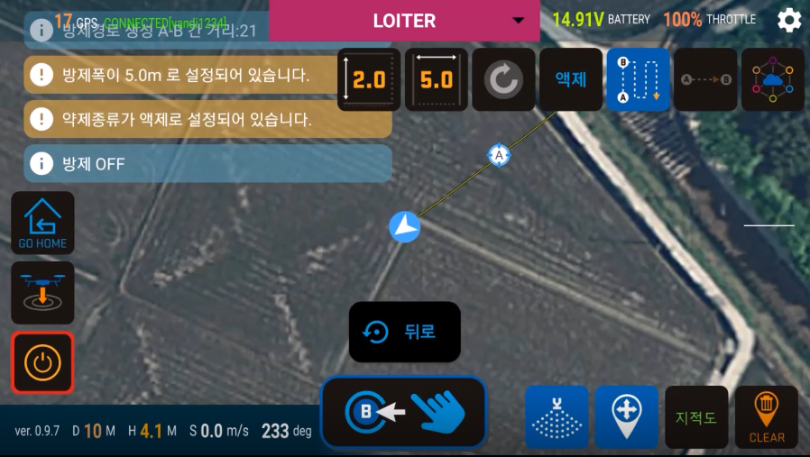
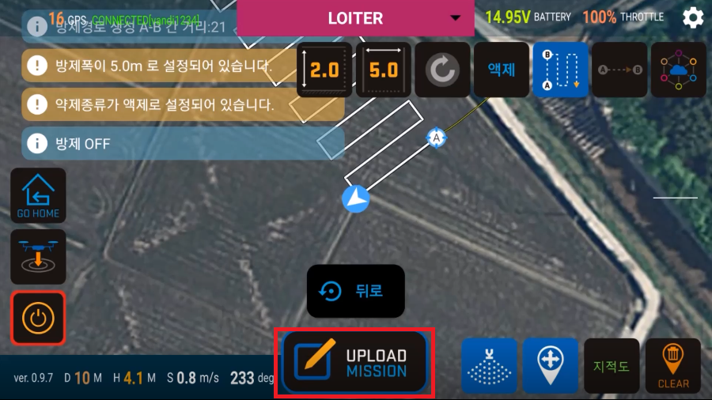
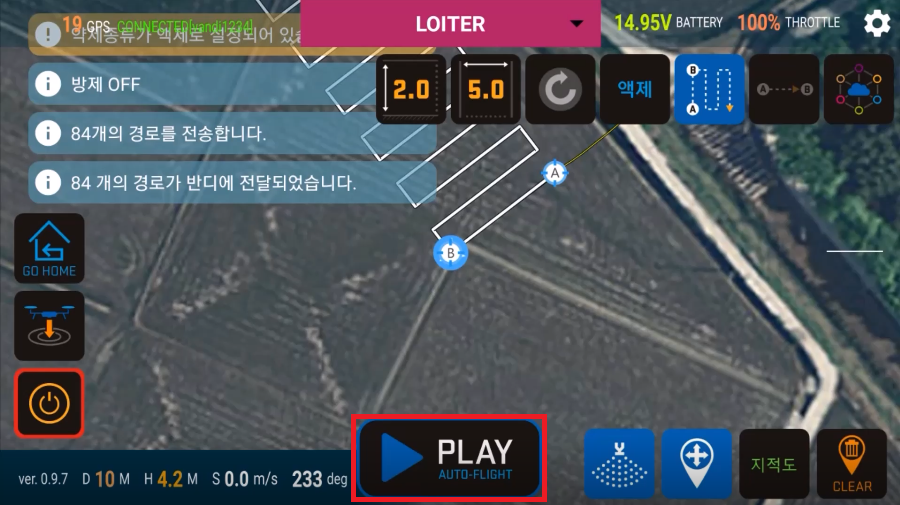

# AB 방제
##### AB 방제는 A, B 두 지점을 선택하여 그 기준선의 왼쪽 또는 오른쪽 방향으로 원하는 사각형 모양의 방제 경로를 생성한 뒤, 생성된 경로에 따라 자동방제를 진행하는 기능입니다.

1. AB방제 시작하기  
    아래의 붉은 테두리로 표시된 버튼을 클릭하면 그 아래로 자동방제를 하고자 하는 방향을 선택하기 위한 두가지의 버튼이 보입니다. 원하는 방향의 버튼을 클릭하십시오.
     
     

1. AB - A  
    AB자동방제는 사각형의 방제경로를 전제로 하므로 가상의 사각형 자동방제경로를 가정했을때, 자동방제를 시작하기 원하는 한 쪽 모서리의 시작지점에 기체를 이동시킨 후 하단의 A 버튼을 클릭합니다.
     
     

1. AB - B  
    * A 버튼을 클릭한 후 가상의 사각형의 나머지 모서리의 위치에 기체를 이동시킨 후 하단의 B 버튼을 클릭합니다. B 버튼이 클릭되면, 시작시 선택한 방향으로 계산된 가상의 사각형의 방제 경로가 생성되어 보이게 됩니다.
     
     
    * A, B 지점 설정을 통해 생성되는 방제경로는 아래와 같은 사각형 형태입니다  
     

1. AB 롤백  
    * B 버튼을 클릭하여 생성된 방제경로를 기체로 전달하기 전에는 A지점, B지점 선택의 작업을 취소하고 이전 단계로 돌아갈 수 있습니다. 하단에 표시된 '뒤로' 버튼을 클릭하여 작업을 한단계 전으로 되돌릴 수 있습니다. 예를 들어 B 지점을 지정한 후에 '뒤로' 버튼을 클릭하면 다시 B지점을 지정할 수 있습니다.
     
     
    * '뒤로' 버튼을 누르면 선택했던 B지점이 취소됩니다  
     

1. 생성된 경로 회전 기능 사용하기  
   TODO

1. 생성된 방제경로를 사용하려면 기체에 경로 데이터를 전송해야 합니다. 하단에 표시된 'UPLOAD' 버튼을 클릭하여 전송합니다.  
     

1. 방제경로가 정상적으로 전달되면 'PLAY' 버튼이 보이게 됩니다. 이 버튼을 누르면 자동방제를 시작하게 됩니다.  
     