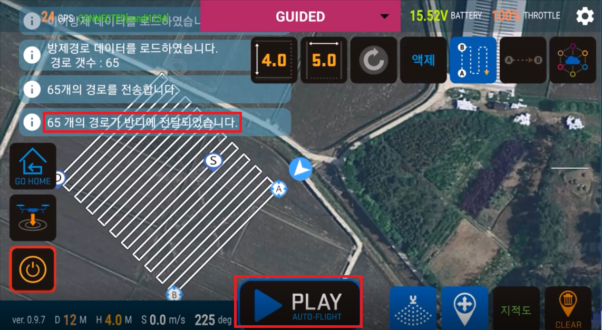

# 이어방제란?
자동방제(AB방제) 기능을 사용하여 방제를 진행하던 중 기타 사정으로 방제를 중단하여야 하는 경우가 생길 수 있습니다. 그러한 경우에 자동방제를 중단하는 지점을 저장 하였다가, 중단하여야 하는 사유가 제거되고 난 후에 다시 중단되었던 지점부터 방제를 계속해서 진행할 수 있게 하는 기능입니다.

1. 자동방제 중단  
 

1. 자동방제 중단 후 모터 가동 해제  
 

1. 재시동  
 

1. 이어방제버튼  
 

1. 이어방제 경고  
 
 
1. 이어방제 경고 2  
 

1. 남은 경로 전송 후 Play 버튼  
 