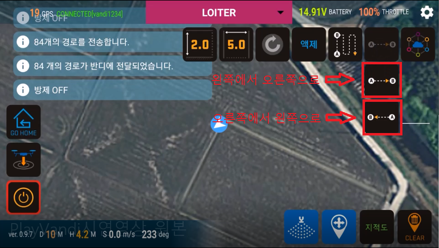

# 턴 어시스트 (Turn assist)

####  턴 어시스트는 기체의 좌, 우측으로 일정 거리만큼 자동으로 이동하는 기능입니다.
시작하기  
     
위 그림의 턴어시스트 버튼 그룹 중 맨 위쪽의 버튼을 누르면 아래의 두 버튼이 나타납니다. 이동하고자 하는 방향의 버튼을 누릅니다.  
     
그러면 아래와 같이 중앙 하단에 Play 버튼이 나타납니다.  
     
Play 버튼을 누르면 이동을 시작합니다.