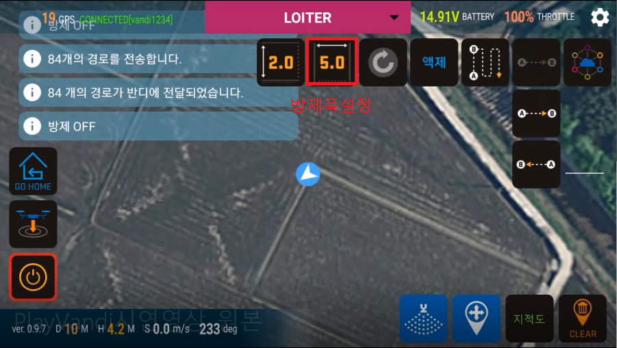
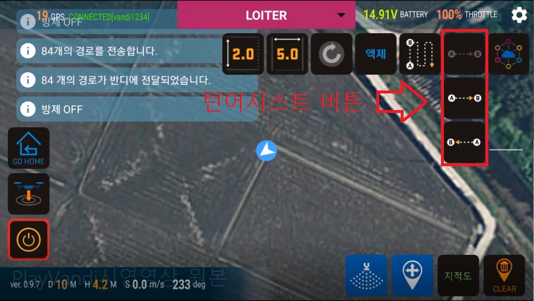
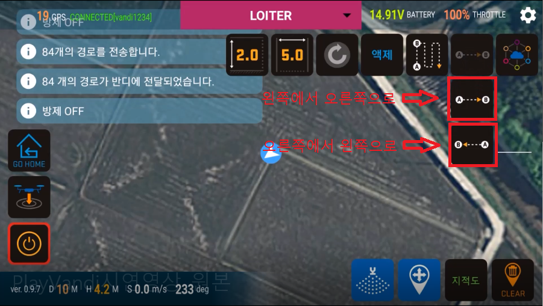
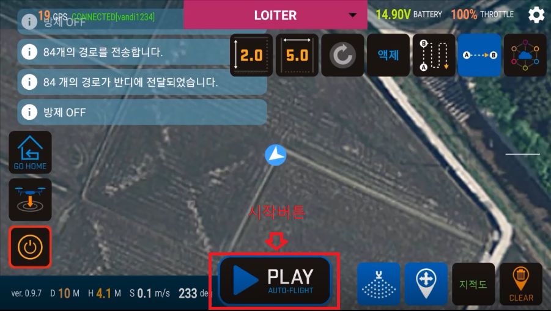

# 턴 어시스트 (Turn assist)

> 턴 어시스트는 기체의 좌, 우측으로 미리 설정한 일정 거리만큼 자동으로 이동하는 기능입니다.

 

1. 턴어시스트를 사용하기 전 원하는 방제폭이 설정되어 있는지 확인하여야 합니다. 아래에 표시된 방제폭 설정 버튼을 이용하여 원하는 방제폭을 설정하십시오.  
     

1. 턴어시스트 시작  
    하단의 버튼들 중 맨 위의 버튼을 누르면 아래의 방향을 선택하는 2가지 버튼이 나타납니다.  
     

2. 이동하고자 하는 방향에 맞게 버튼을 누릅니다.  
     

3. 그러면 아래와 같이 중앙 하단에 Play 버튼이 나타납니다.  
     
4. Play 버튼을 누르면 이동을 시작합니다.