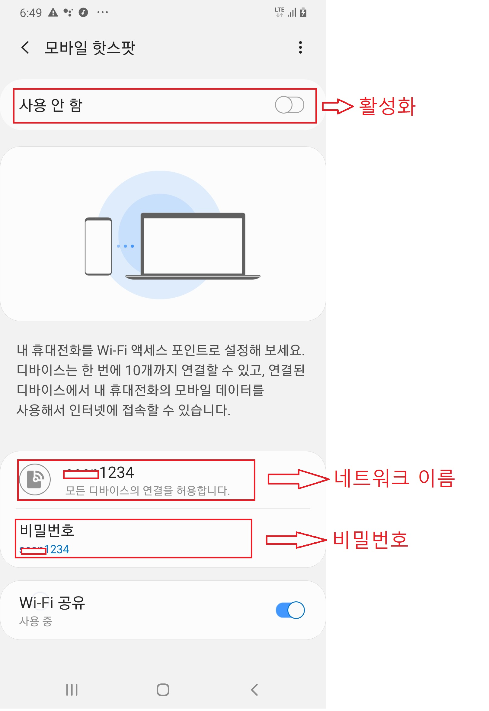

# 앱이 설치된 단말기에서 바로 기체에 연결하기

#### 앱이 설치된 단말기와 기체를 바로 연결
1. 이 방식은 미리 설정된 단말기의 핫스팟 네트워크에 기체의 Wi-fi 모듈이 연결을 하는 방식입니다.
2. 사용자는 기체의 Wi-fi 모듈 정보(네트워크 이름, 비밀번호)가 어떻게 설정되어 있는지 미리 알고 있어야 합니다.
3. 미리 알고 있는 Wi-fi 모듈 정보에 맞게 단말기의 핫스팟 정보를 설정해야 합니다. 이때 핫스팟이 활성화 되어 있지 않으면 먼저 활성화 한 후 설정하십시오.

    * 단말기의 핫스팟 설정  
        단말기의 설정 -> 연결 -> 모바일 핫스팟 및 테더링 -> 모바일 핫스팟 -> 모바일 핫스팟이 활성화 되어 있지 않은 경우 활성화  
        
4. 알맞게 설정된 핫스팟을 먼저 활성화 한 후 기체의 전원을 연결하십시오.
5. 연결이 원활하지 않을 경우 핫스팟의 네트워크 설정이 정확하게 되어 있는지 확인 후 기체의 전원을 분리 후 다시 연결하십시오.
6. 단말기에 기체가 연결된 경우 핫스팟 설정 화면 하단에 연결된 장비의 이름을 확인 할 수 있습니다.
